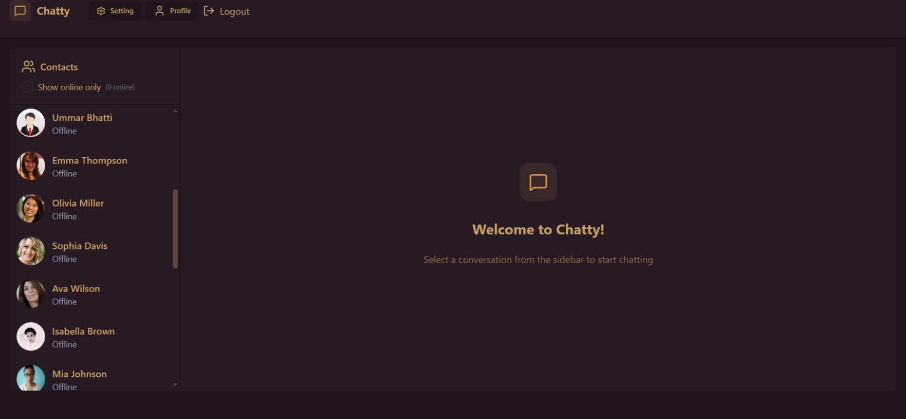
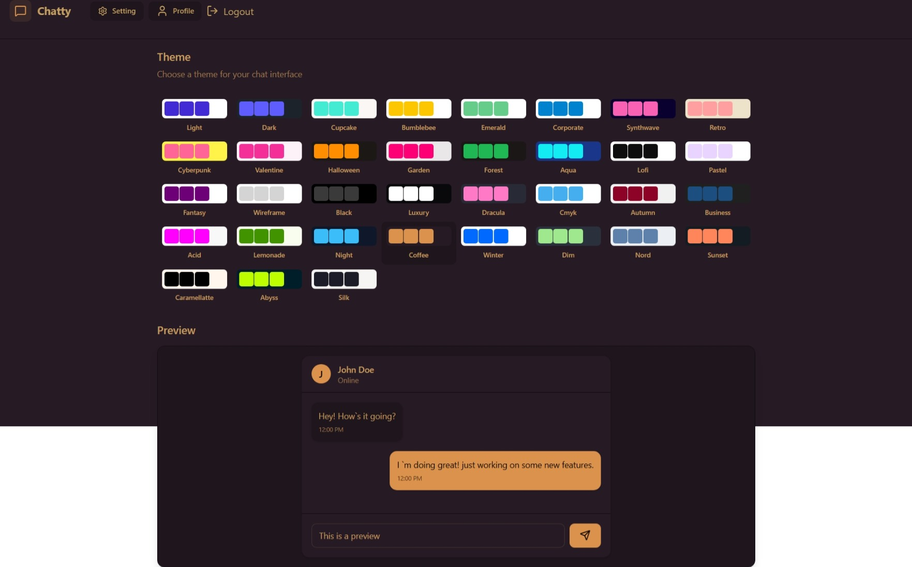
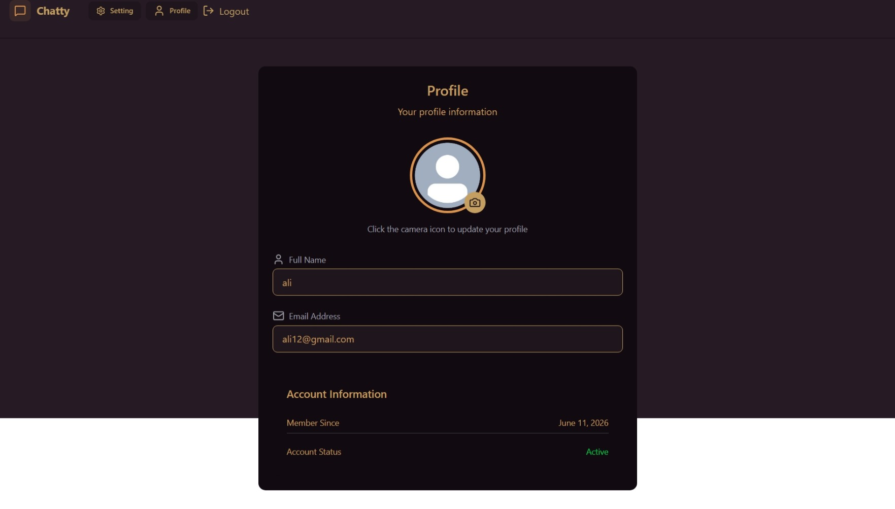
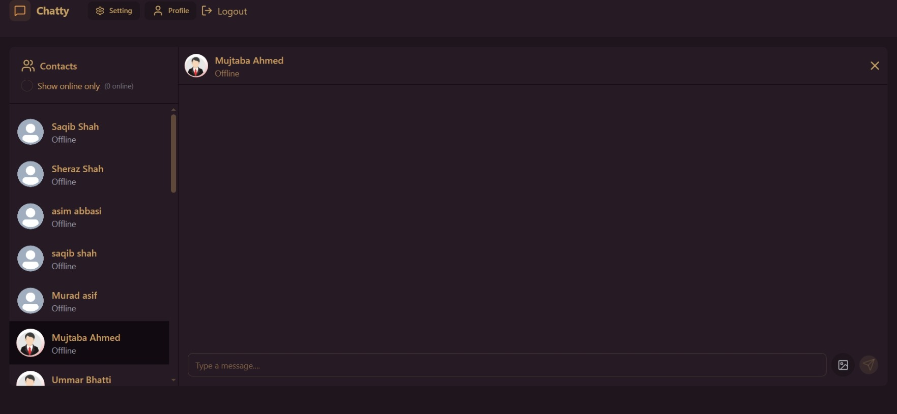
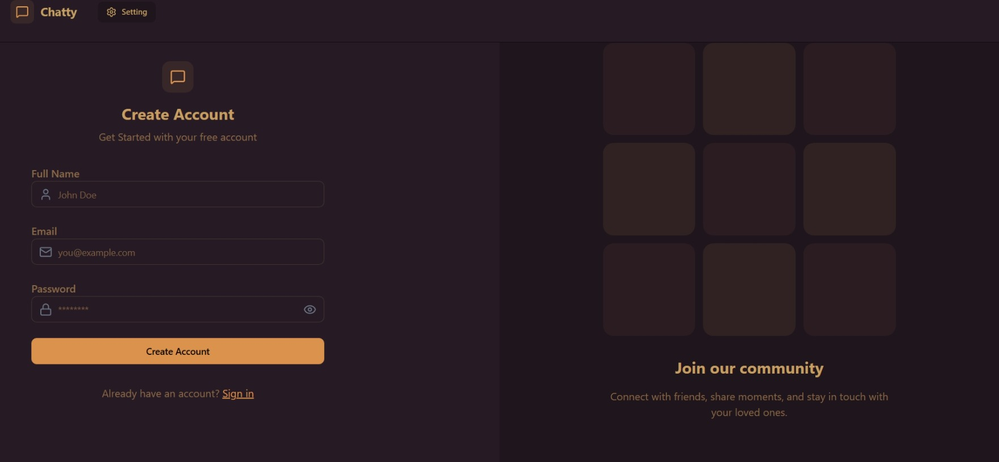
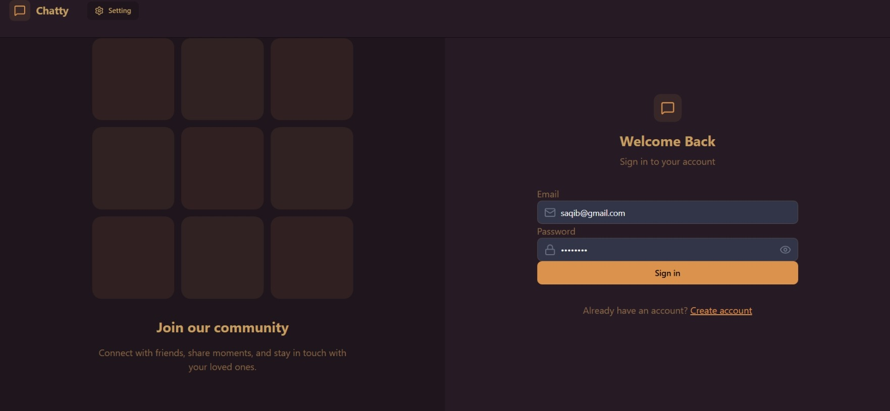
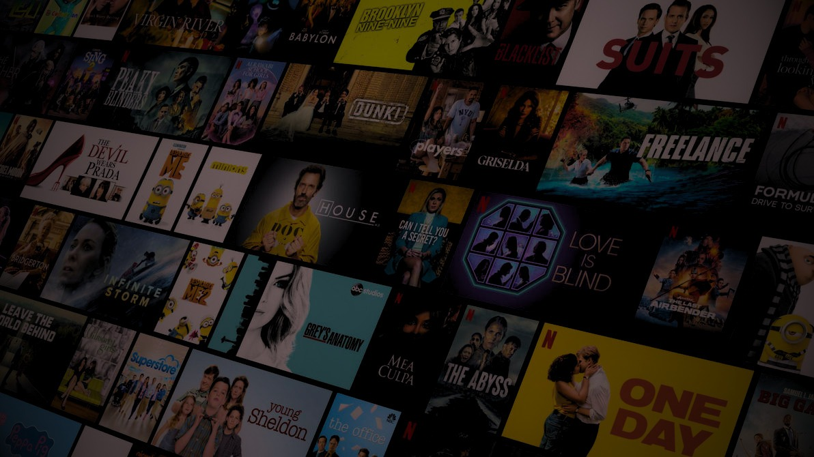

# Chatty - Real-Time Chat Application


A full-stack, real-time chat application built with the MERN stack (MongoDB, Express.js, React, Node.js) and Socket.io. This project features instant messaging, secure user authentication, image sharing, and a modern, dark-themed responsive UI design.

## Features

- **Real-Time Messaging:** Instant message delivery using WebSocket (`Socket.io`).
- **User Authentication:** Secure signup and login functionality using JWT (JSON Web Tokens) and Bcrypt for password hashing.
- **Media Sharing:** Users can share images seamlessly, powered by Cloudinary integration.
- **Modern UI/UX:** A clean, responsive, and beautiful user interface built with React 19, Tailwind CSS v4, and daisyUI.
- **State Management:** Efficient global state handling using `Zustand`.
- **Online Status:** Real-time indicators showing which users are currently online.
- **Form Handling & Notifications:** Smooth user experience with React Hot Toast for instant feedback.

## Tech Stack

### Frontend
- **Framework:** React 19 (Vite)
- **Styling:** Tailwind CSS v4, daisyUI
- **State Management:** Zustand
- **Routing:** React Router DOM
- **Icons:** Lucide React
- **HTTP Client:** Axios
- **Real-Time:** Socket.io-client

### Backend
- **Runtime:** Node.js
- **Framework:** Express.js
- **Database:** MongoDB (Mongoose)
- **Real-Time:** Socket.io
- **Authentication:** JWT & Bcrypt.js
- **Cloud Storage:** Cloudinary (for image uploads)

## Screenshots

Here are some glimpses of the Chatty application in action:

<div align="center">
  
  
  
  
  
  
  
</div>

## Getting Started

Follow these steps to set up the project locally on your machine.

### Prerequisites

Make sure you have the following installed:
- [Node.js](https://nodejs.org/) (v18 or higher recommended)
- [MongoDB](https://www.mongodb.com/) (Local instance or MongoDB Atlas)
- A [Cloudinary](https://cloudinary.com/) account for image uploads.

### 1. Clone the repository

```bash
git clone https://github.com/SaqibShah-dev/FullStack-ChatApplication.git
cd ChatApplication
```

### 2. Install dependencies

This project uses a root `package.json` to manage both frontend and backend scripts.

```bash
# Install root dependencies (concurrently)
npm install

# Install frontend and backend dependencies
npm run build
```

### 3. Environment Variables

Navigate to the `Backend` folder and create a `.env` file:

```bash
cd Backend
```

Create a `.env` file in the `Backend` directory and configure the necessary environment variables:
- **Database:** `MONGO_URI`
- **Server:** `PORT`, `NODE_ENV`
- **Auth:** `JWT_SECRET`
- **Cloudinary:** `Cloudinary_Cloud_Name`, `Cloudinary_API_Key`, `Cloudinary_API_Secret`

### 4. Run the Application

You can start both the frontend and backend servers simultaneously from the root directory using `concurrently`:

```bash
# Make sure you are in the root directory (ChatApplication)
npm run dev
```

- The **Frontend** will run on `http://localhost:5173`
- The **Backend** server will run on `http://localhost:5001`

## Project Structure

```
ChatApplication/
├── Backend/               # Node.js + Express backend
│   ├── src/               # Controllers, Models, Routes, etc.
│   ├── .env               # Backend environment variables
│   └── package.json       # Backend dependencies
├── frontend/              # React frontend
│   ├── src/               # Components, Pages, Stores (Zustand), etc.
│   ├── vite.config.js     # Vite configuration
│   └── package.json       # Frontend dependencies
└── package.json           # Root package.json (Scripts to run both apps)
```

## Future Improvements
- [ ] Add group chat functionality.
- [ ] Implement message read receipts.
- [ ] Add voice/video call features using WebRTC.
- [ ] Push notifications for offline messages.

## Author

**Saqib Shah**
- **GitHub:** [@SaqibShah-dev](https://github.com/SaqibShah-dev)
- **LinkedIn:** [Saqib Shah](https://www.linkedin.com/in/saqib-shah-374392290)


---
*If you like this project, please consider giving it a ⭐ on GitHub!*
